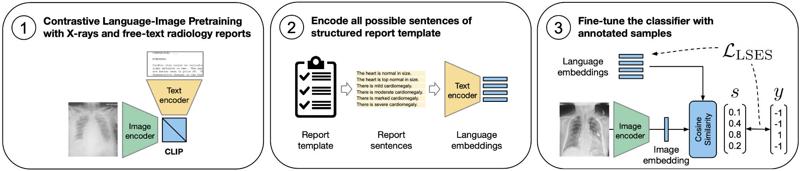

[](https://arxiv.org/abs/2203.15723)
[](https://openreview.net/forum?id=wiN5LQThnIV)
[](https://2023.midl.io/papers/p162)
[](https://proceedings.mlr.press/v227/keicher24a.html)
# FlexR: Few-shot Classification with Language Embeddings for Structured Reporting of Chest X-rays
**Authors**: [Matthias Keicher][mk], [Kamilia Zaripova][kz], [Tobias Czempiel][tc], [Kristina Mach][km], [Ashkan Khakzar][ak], [Nassir Navab][nn]

[Vision-Language Group](https://github.com/CAMP-ViL) @ [Computer Aided Medical Procedures (CAMP)](https://www.cs.cit.tum.de/camp/), [Technical University of Munich](https://www.tum.de/)

[mk]:https://www.cs.cit.tum.de/camp/members/matthias-keicher/
[kz]:https://www.cs.cit.tum.de/camp/members/kamilia-zaripova/
[tc]:https://www.cs.cit.tum.de/camp/members/tobias-czempiel/
[km]:https://scholar.google.com/citations?user=nvMY9T0AAAAJ&hl=en
[ak]:https://ashk-on.github.io/
[nn]:https://www.cs.cit.tum.de/camp/members/cv-nassir-navab/nassir-navab/

*This is the official repository for the paper [FlexR: Few-shot Classification with Language Embeddings for Structured Reporting of Chest X-rays](https://proceedings.mlr.press/v227/keicher24a.html), presented at [MIDL 2023](https://2023.midl.io/papers/p162ttps://2023.midl.io/papers/p162).*


**✨ News ✨**
- 10 July 2024: Added the code for the original FlexR model and the preprocessing pipeline


### Abstract
The automation of chest X-ray reporting has garnered significant interest due to the time-consuming nature of the task. However, the clinical accuracy of free-text reports has proven challenging to quantify using natural language processing metrics, given the complexity of medical information, the variety of writing styles, and the potential for typos and inconsistencies. Structured reporting with standardized reports, conversely, can provide consistency and formalize the evaluation of clinical correctness. However, high-quality annota- tions of standardized reports are scarce. Therefore, we propose a data-efficient method based on contrastive pretraining with free-text radiology reports to predict clinical findings as defined by structured reporting templates. The method can be used to fill such templates for generating standardized reports.

### Method



FlexR is a method for fine-tuning vision-language models when zero-shot performance proves insufficient. It builds on zero-shot classification by initializing class embeddings using their textual descriptions and subsequently optimizes these embeddings with a limited number of annotated samples. This method's versatility allows for applications in the classification of fine-grained clinical findings such as disease grading and localization as well as the prediction of rare findings in long-tailed class distributions.

Applied to the prediction of clinical findings defined by sentences in standardized reports, the method consists of the following steps:
1. Contrastive language-image pretraining (CLIP) on a dataset of radiology images and free-text reports
2. Encode possible clinical findings of the structured report into language embeddings (zero-shot initialization)
3. Fine-tune these language embeddings by optimizing cosine similarity with image embeddings using the LogSumExpSign-Loss designed for long-tailed distributions


## Setup environment

### Single command for setting up the environment and dependencies with conda:
```
conda create -y -n flexr python=3.9 mamba -c conda-forge && conda activate flexr && conda install -y pytorch==1.13.1 torchvision==0.14.1 torchaudio==0.13.1 cudatoolkit=11.6 -c pytorch && mamba install -y cupy pkg-config libjpeg-turbo opencv numba -c conda-forge && python -m pip install -r requirements.txt
```

<details>
  <summary>Step-by-step setup</summary>
  
1. Create a new conda environment and install mamba

`
conda create -y -n flexr python=3.9 mamba -c conda-forge && conda activate flexr
`

2. Install pytorch 1.12.1 for cuda 11.3

`
conda install -y pytorch==1.13.1 torchvision==0.14.1 torchaudio==0.13.1 cudatoolkit=11.6 -c pytorch
`

3. Install dependencies for ffcv (dataloading)

`
mamba install -y cupy pkg-config libjpeg-turbo opencv numba -c conda-forge
`

4. Install remaining packages: ffcv, pytorch-lightning, transformers, monai, etc.

`
python -m pip install -r requirements.txt
`

</details>


## Data Preparation

### 1) Download MIMIC-CXR-JPG dataset
- Download the MIMIC-CXR-JPG dataset from [here](https://www.physionet.org/content/mimic-cxr-jpg/2.0.0/)
- FlexR uses the images for contrastive pretraining and the `mimic-cxr-2.0.0-split.csv` for excluding the test studies from training

### 2) Download Chest ImaGenome Dataset dataset
- Download the Chest ImaGenome Dataset dataset from [here](https://physionet.org/content/chest-imagenome/1.0.0/)
- FlexR uses the processed report sentences for contrastive pretraining and triplets extracted from the scene graphs for modelling structured reporting


### 3) Data preprocessing
The script `preprocess/imagenome_to_fccv_dataset.py` resizes preprocesses the images from MIMIC-CXR-JPG, extracts triplets from the ImaGenome scene graphs and creates an [FCCV dataset](https://github.com/libffcv/ffcv). It requires three args:
- `--mimic_cxr_path`: Path to the MIMIC-CXR-JPG dataset (should end with 2.0.0)
- `--imagenome_path`: Path to the Chest ImaGenome Dataset
- `--output_dir`: Path to the output directory for the dataset (will create a folder within)
```
python preprocess/imagenome_to_fccv_dataset.py --mimic_cxr_path DATA_PATH/mimic-cxr-jpg/2.0.0 --imagenome_path DATA_PATH/chest-imagenome/ --output_dir DATASETS_PATH
```

### 4) Download model checkpoints
Required for FlexR-CLIP pretraining:
- Download the pretrained DenseNet121 from [here](https://github.com/mkeicher/FlexR/releases/download/v1.0/densenet121_pretrained.ckpt) and put it in the `checkpoints` folder 

```
wget -P checkpoints https://github.com/mkeicher/FlexR/releases/download/v1.0/densenet121_pretrained.ckpt
```
- Download the pretrained FlexR-CLIP model from [here](https://github.com/mkeicher/FlexR/releases/download/v1.0/FlexR-CLIP.ckpt) and put it in the `checkpoints` folder

```
wget -P checkpoints https://github.com/mkeicher/FlexR/releases/download/v1.0/FlexR-CLIP.ckpt
```

## FlexR Experiments
Before running any experiments make sure to adjust the following settings either in respective config file or via command line arguments:
- `--data.init_args.data_dir`: Path to the FCCV dataset created above
- `--trainer.logger.save_dir`: Path to the output directory for the logs and checkpoints
- `--trainer.logger.entity`: Your Weights & Biases entity. Alternatively, set `--trainer.logger.offline=true` to disable online logging

### 1) FlexR-CLIP: Contrastive Language-Image Pretraining

To reproduce the contrastive pretraining used in the original FlexR model run the following command:

```
python trainer.py fit --config=FlexR-1_clip.yaml
```
Make sure to download the pretrained DenseNet121 checkpoint as described above before training.


### 2) FlexR-finetune: Few-shot Classification with Language Embeddings
#### Training - Localized Pathology Detection
The following command finetunes the FlexR classifier initialized with the language embeddings created with FlexR-CLIP using the whole Imagenome dataset without sampling applied:
```
python trainer.py fit --config=FlexR-1_finetune.yaml
```
For sampling a fixed number of random samples per class each epoch set the sampling rate to a fixed number e.g. `fixed128` for 128 samples as used in the experiments:
```
python trainer.py fit --config=FlexR-1_finetune.yaml --data.init_args.sampling=fixed128
```
For a few-shot setting the sampling can be set to `1shot128` or `5shot128` etc. for 1 or 5 samples per class sampled 128 times per epoch. In this setting the samples are only drawn once per training and not replaced.:
```
python trainer.py fit --config=FlexR-1_finetune.yaml --data.init_args.sampling=10shot128
```
#### Testing - Localized Pathology Detection
For testing these models on the Imagenome test set run:
```
trainer.py test --ckpt_path=PATH_TO_CHECKPOINT
```
With the `--ckpt_path` argument pointing to the FlexR-finetune model checkpoint of the model to be evaluated. Since the validation set should not be considered in a few-shot setting, make sure to use the `last.ckpt` for evaluation.

## Citation
If you find this code useful, please consider citing our paper:

```
@InProceedings{pmlr-v227-keicher24a,
  title = 	 {FlexR: Few-shot Classification with Language Embeddings for Structured Reporting of Chest X-rays},
  author =       {Keicher, Matthias and Zaripova, Kamilia and Czempiel, Tobias and Mach, Kristina and Khakzar, Ashkan and Navab, Nassir},
  booktitle = 	 {Medical Imaging with Deep Learning},
  pages = 	 {1493--1508},
  year = 	 {2024},
  editor = 	 {Oguz, Ipek and Noble, Jack and Li, Xiaoxiao and Styner, Martin and Baumgartner, Christian and Rusu, Mirabela and Heinmann, Tobias and Kontos, Despina and Landman, Bennett and Dawant, Benoit},
  volume = 	 {227},
  series = 	 {Proceedings of Machine Learning Research},
  month = 	 {10--12 Jul},
  publisher =    {PMLR},
}
```

## Acknowledgements

The code is based on the huggingface CLIP impelementation inspired by CLIP from OpenAI. The image and text encoder of FlexR is build on DenseNet121 and SciBERT respectively. The data preprocessing pipeline is based on FCCV and MONAI. The training and evaluation is implemented using PyTorch Lightning. The FlexR model was trained on the MIMIC-CXR-JPG and Chest Imagenome datasets, which should be cited when using the data. We would like to thank the authors of these libraries and datasets for their contributions to the community.

The authors acknowledge the financial support by the Federal Ministry of Education and
Research of Germany (BMBF) under project DIVA (FKZ 13GW0469C). Ashkan Khakzar
was partially supported by the Munich Center for Machine Learning (MCML) with funding
from the BMBF under project 01IS18036B. Kamilia Zaripova and Kristina Mach were
partially supported by the Linde & Munich Data Science Institute, Technical University of
Munich Ph.D. Fellowship.